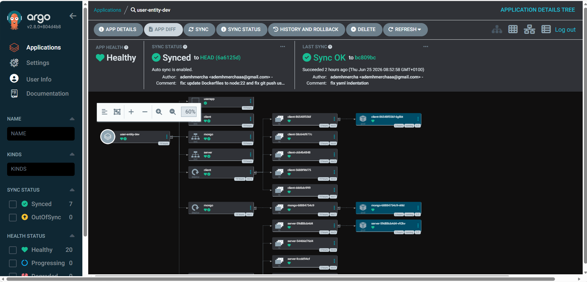
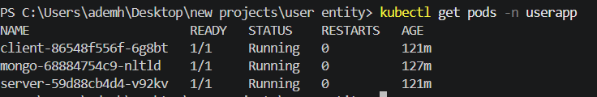

# User Authentication System

Full-stack auth system with **Node.js (Express)** + **React (Vite)** + **MongoDB**, deployed on **Kubernetes** via **GitOps** with **ArgoCD**.


---

## Features

- Register with email verification
- Login with JWT stored in httpOnly cookie
- Protected profile route (`/me`)
- Forgot / Reset password via email (Nodemailer)
- Input validation on all endpoints
- CORS configured for frontend

---

## Tech Stack

| Layer | Technology |
|-------|-----------|
| Frontend | React 18, Vite 5, React Router 7, Axios |
| Backend | Node.js 22, Express 4, Mongoose 8, JWT, bcryptjs |
| Database | MongoDB 6 |
| Reverse Proxy | Nginx (SPA fallback + API proxy) |
| Containerization | Docker, Docker Compose |
| Orchestration | Kubernetes (Kustomize base + dev/prod overlays) |
| GitOps | ArgoCD — automated sync, prune, self-heal |
| CI/CD | GitHub Actions — build, push, manifest update |

---

## Architecture

```
┌─────────┐       ┌─────────────────────────────────────┐
│ Browser │ ──►   │           Nginx (Client)             │
│         │       │  / ──► serve SPA                      │
│         │       │  /api/ ──► proxy_pass server:5000     │
└─────────┘       └──────────┬──────────────────────────┘
                             │
                             ▼
                    ┌──────────────────┐     ┌──────────┐
                    │  Express Server  │ ──► │ MongoDB  │
                    │   (Port 5000)    │     └──────────┘
                    └──────────────────┘
```

---

## Getting Started

### Prerequisites

- Docker & Docker Compose (for local dev)
- Kubernetes cluster + kubectl (for cluster deployment)
- ArgoCD installed on the cluster (for GitOps)
- Docker Hub account (for CI/CD pipeline)

### Local Development

```bash
git clone https://github.com/ademhmercha/user-entity-REACT-NODE-JS-.git
cd user-entity

# Create server/.env (see below)
docker compose up -d
```

App available at **http://localhost:80**

#### Environment Variables

Create `server/.env`:

```env
PORT=5000
MONGO_URI=mongodb://localhost:27017/user-auth
JWT_SECRET=<generate with: node -e "console.log(require('crypto').randomBytes(64).toString('hex'))">
EMAIL_USER=your_email@gmail.com
EMAIL_PASS=your_16_char_app_password
CLIENT_URL=http://localhost:5173
```

> **Gmail App Password**: Google Account → Security → 2-Step Verification → App passwords

---

## Kubernetes Deployment

The `gitops/` directory uses **Kustomize** for environment management:

```
gitops/
├── base/
│   ├── kustomization.yaml       # Resource list
│   ├── namespace.yaml            # userapp namespace
│   ├── mongo-deployment.yaml     # MongoDB + Service
│   ├── server-deployment.yaml    # Express API + Service
│   └── client-deployment.yaml    # React SPA (NodePort)
├── overlays/
│   ├── dev/                      # 1 server replica
│   │   └── kustomization.yaml
│   └── prod/                     # 2 server replicas
│       └── kustomization.yaml
```

### Apply Directly

```bash
# Dev
kubectl apply -k gitops/overlays/dev

# Prod
kubectl apply -k gitops/overlays/prod

# Check status
kubectl get all -n userapp
```

---

## GitOps with ArgoCD

This is the core delivery mechanism. ArgoCD watches the Git repository and keeps the cluster in sync automatically.

```yaml
# argocd/application.yaml
apiVersion: argoproj.io/v1alpha1
kind: Application
metadata:
  name: user-entity-dev
  namespace: argocd
spec:
  source:
    repoURL: https://github.com/ademhmercha/user-entity-REACT-NODE-JS-.git
    path: gitops/overlays/dev
    targetRevision: HEAD
  destination:
    server: https://kubernetes.default.svc
    namespace: userapp
  syncPolicy:
    automated:
      prune: true       # Remove resources deleted from Git
      selfHeal: true    # Revert manual cluster changes
```

```bash
kubectl apply -f argocd/application.yaml
```

Once applied, ArgoCD continuously monitors the Git repo. Any push to `master` triggers a sync that brings the cluster to the desired state.

---

## CI/CD Pipeline

On every push to `master`, **GitHub Actions** runs:

1. **Build & Push** Docker images to Docker Hub (`ademmmmm/user-entity-server`, `ademmmmm/user-entity-client`) with `latest` + commit SHA tags
2. **Update manifests** — the pipeline commits the new image SHA back to `gitops/base/` deployment files
3. **ArgoCD detects the change** in Git and auto-syncs the new images to the cluster

---

## Screenshots

> Drop your screenshots into the `screenshots/` folder and they'll render here.

### ArgoCD Dashboard

| Screenshot | What to Show |
|-----------|-------------|
|  | `user-entity-dev` with green **Synced** / **Healthy** badges |
|  | Visual tree of Deployments, Services, Pods for client/server/mongo |
|  | Pod health, restarts, container status |
|  | Timeline of syncs triggered by Git commits |
|  | ArgoCD showing pending changes before sync |

### Kubernetes CLI

| Screenshot | What to Show |
|-----------|-------------|
|  | `kubectl get all -n userapp` — all running resources |
|  | `kubectl describe pod <server-pod>` — events and status |
|  | `kubectl get pods -n userapp -w` — rolling update in action |

### Application

| Screenshot | What to Show |
|-----------|-------------|
|  | Login form |
|  | Protected profile after login |

### GitOps Flow Diagram

```
┌──────────┐     ┌───────────────┐     ┌────────────┐     ┌───────────────┐     ┌──────────┐
│  Git Push │ ──► │ GitHub Actions │ ──► │ Docker Hub │ ──► │ ArgoCD Sync   │ ──► │  Cluster │
│  master   │     │ Build & Push   │     │ Images      │     │ Detects Drift  │     │  Ready   │
└──────────┘     └───────────────┘     └────────────┘     └───────────────┘     └──────────┘
```

Create this as `screenshots/gitops-flow.png` for a polished README.

---

## Project Structure

```
user-entity/
├── .github/workflows/ci.yml       # CI/CD pipeline
├── argocd/application.yaml        # ArgoCD Application manifest
├── gitops/                         # Kubernetes manifests (Kustomize)
│   ├── base/                       #   Shared resources
│   └── overlays/                   #   Dev / Prod patches
├── server/                         # Express API (Node.js)
│   ├── controllers/                #   Route handlers
│   ├── middleware/                  #   JWT auth middleware
│   ├── models/                     #   Mongoose schemas
│   ├── routes/                     #   Express route definitions
│   └── utils/                      #   Email utility (Nodemailer)
├── client/                         # React SPA (Vite)
│   ├── src/pages/                  #   Page components
│   ├── src/api/                    #   Axios API client
│   ├── Dockerfile                  #   Multi-stage (Nginx)
│   └── nginx.conf                  #   Reverse proxy config
├── docker-compose.yml              # Local development
└── README.md
```
